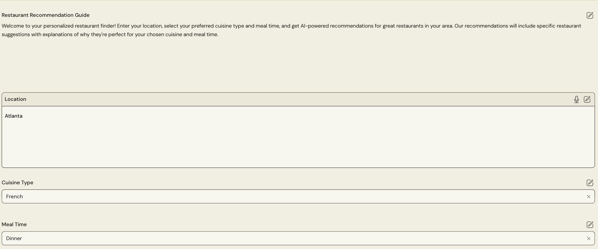
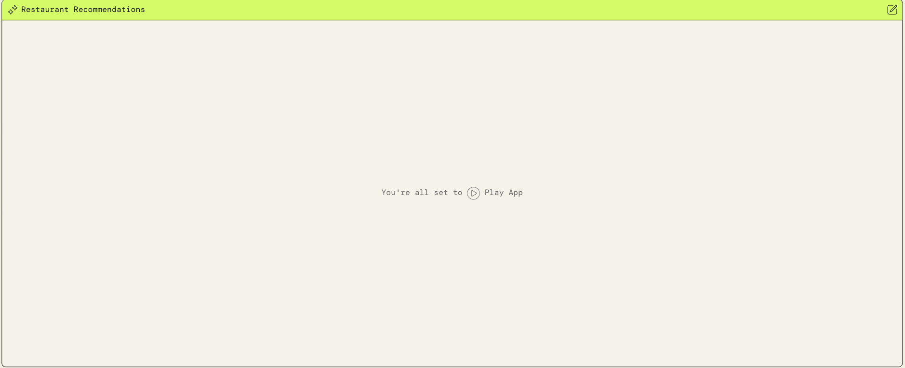

# Restaurant Recommender

## 🌟 Overview
In this project, I used PartyRock to develop a Restaurant Recommender to assist users in finding a restaurant based on the user’s input, location, preferred cuisine and mealtime. PartyRock is a new platform offered by AWS designed to simplify app development through the use of generative AI. 

## 🛠️ Services Used
**AWS PartyRock**: Go to [partyrock homepage](https://partyrock.aws/) and create an account.  

After your account is created to can start creating your application without any code.

## ☁️ AWS Architecture
**AWS PartyRock**: A fun playground offered by AWS to build applications with generative AI. It helps you make your own apps with AI, without having any coding experience.

## &rarr; Final Result
[Restaurant Recommender](https://partyrock.aws/u/tparrish/eWfnzmEst/FoodFinder-Pro%253A-AI-Restaurant-Recommender) - Enter in location, preferred cuisine and mealtime, then click the Play App button.

After the play button is clicked the user will get a list of restaurant along with an description and a picture of a dish that matches the user's input.

